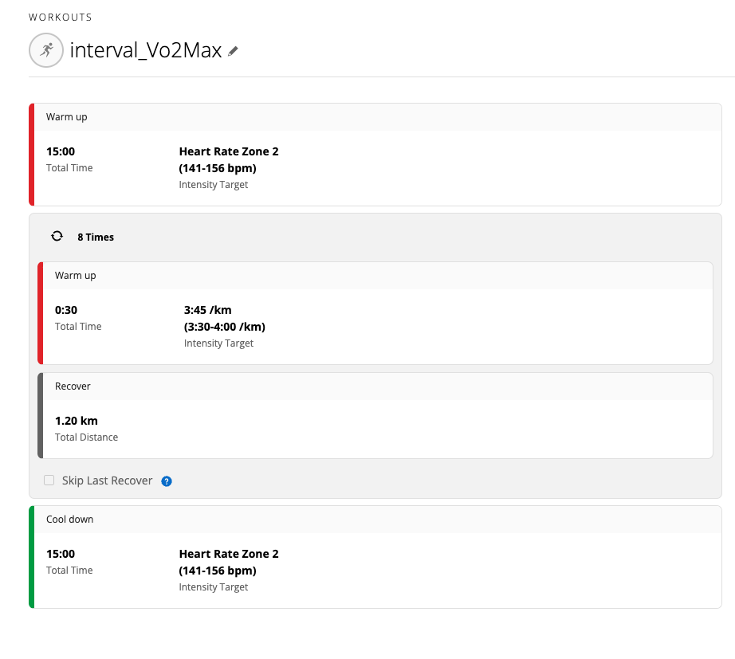

# Unofficial Garmin Sync (TEST ONLY)

This service uses an unofficial integration path for Garmin testing only.

⚠️ **DO NOT enable this for normal production users until Garmin approval.**

## Feature Flag

- `GARMIN_UNOFFICIAL_SYNC_ENABLED=true` (dev/testing)
- `GARMIN_UNOFFICIAL_SYNC_ENABLED=false` (production)

---

# Garmin Planner
This is a Python program reads a YAML configuration file to create and schedule workouts on Garmin Connect. It remove the needs of manual workout management on the garmin connect web by automating the creation and scheduelling processes in bulk. 

## Motivation
Garmin users would know how much of a pain in the A it is to create and manage workouts on garmin connect, especially when you are following a structured marathon plan. I wrote this Garmin Planner to simplify the planning and scheduling of workouts, so we all can hit our PBs.


## Features

- **Workout Creations**: Create various types of workouts (e.g., intervals, easy runs) with associated details like warmup and cooldown periods on garmin connect.
- **Scheduling**: Schedulling workouts created on garmin connect.

## Input YAML Structure

Your YAML configuration should include the following sections:

1. **User Credentials**:
   - `email`: Your Garmin Connect email address.
   - `password`: Your Garmin Connect password.

2. **Settings**:
   - `deleteSameNameWorkout`: A boolean indicating whether to delete existing workouts with the same name during creation of workout.

3. **Definitions** (optional):
   - A set of predefined values can be used in workout creation, this is optional you can use raw value instead of using this.

4. **Workouts**:
   - Define each workout details for workout creation.
   - For HIIT workouts, use the format: `workout_name: { sport: hiit, steps: [...] }`
   - For running/strength workouts, use the format: `workout_name: [...]`

5. **Schedule Plan**:
   - Specify the start date and the sequence of workouts for workout schedulling. 
   - (This will get all the workouts created on garmin connect, schedule them based on the workout name, if the workout is not found on garmin connect it will skip the day) 

### Sample YAML Structure

```yaml
email: "example@gmail.com"
password: "password"

settings:
  deleteSameNameWorkout: true

definitions:
  GA: 6:35-7:00
  Threshold: 5:20-5:45
  VO2MaxP: 3:30-4:00

workouts:
  interval_Vo2Max:
    - warmup: 15min @H(z2)
    - repeat(8):
      - run: 30sec @P($VO2MaxP) # can use definition here or raw value 3:30-4:00
      - recovery: 1200m
    - cooldown: 15min @H(z2)

schedulePlan:
  start_from: 2024-10-08
  workouts: 
    - interval_Vo2Max   # will be schedule on 2024-10-08
    - ga_5k             # will be schedule on 2024-10-09
    - rest              # if no "rest" workout found on garmin connect, skip this day
```

The interval_Vo2Max defined above translate to garmin plan below:


## Workout Types

### Running Workouts
Default workout type. Uses `run`, `warmup`, `cooldown`, `recovery` steps.

### Strength Workouts
See `STRENGTH_WORKOUT_GUIDE.md` for detailed documentation on creating strength workouts.

### HIIT Workouts
HIIT (High-Intensity Interval Training) workouts use a different structure and sport type.

#### Specifying HIIT Sport Type
To create a HIIT workout, specify the sport type in the workout definition:

```yaml
workouts:
  my_hiit_workout:
    sport: hiit
    steps:
      - warmup:
        - run: lap
      - repeatUntilTime(35min):
        - run: lap
        - "Burpee [category: TOTAL_BODY]": "lap | 20 reps"
      - cooldown:
        - run: lap
```

#### Key Differences for HIIT Workouts

1. **Sport Type**: Must specify `sport: hiit` in the workout definition
2. **Run Steps**: Use `run: lap` which creates "Run Indoor" exercises (category: RUN_INDOOR)
3. **Warmup/Cooldown**: Use `run: lap` inside warmup/cooldown, which creates Cardio steps
4. **Time-Based Repeats**: Use `repeatUntilTime(Xmin)` or `repeatUntilTime(X)` (seconds) instead of `repeat(n)`
5. **Exercise End Conditions**: All exercises in HIIT workouts should use `lap` button, with time/reps in descriptions

#### Time-Based Repeats
HIIT workouts support time-based repeats using `repeatUntilTime`:

```yaml
- repeatUntilTime(35min):  # 35 minutes
  - run: lap
  - "Exercise Name": "lap | description"

- repeatUntilTime(2100):   # 2100 seconds (35 minutes)
  - run: lap
  - "Exercise Name": "lap | description"
```

#### Exercise Format in HIIT Workouts
For exercises in HIIT workouts, use the lap button with time/reps in the description:

```yaml
# Correct format for HIIT exercises:
- "Burpee [category: TOTAL_BODY]": "lap | 20 reps"
- "Ski Moguls [category: CARDIO]": "lap | 60s"
- "Farmer's Carry [category: CARRY]": "lap | 60s"
- "Walking Lunge [category: LUNGE]": "lap | 80 reps"

# NOT this format (will cause errors):
- "Burpee": 20 reps        # ❌ Don't use reps directly
- "Ski Moguls": 60s        # ❌ Don't use time directly
```

#### Complete HIIT Workout Example

```yaml
settings:
  deleteSameNameWorkout: true

workouts:
  "HIIT Workout Example":
    sport: hiit
    steps:
      - warmup:
        - run: lap
      - repeatUntilTime(35min):
        - run: lap
        - "Farmer's Carry [category: CARRY]": "lap | 60s"
        - run: lap
        - "Walking Lunge [category: LUNGE]": "lap | 80 reps"
        - run: lap
        - "Ski Moguls [category: CARDIO]": "lap | 60s"
        - run: lap
        - "Wall Ball [category: PLYO]": "lap | 40 reps"
        - run: lap
        - "Burpee [category: TOTAL_BODY]": "lap | 20 reps"
      - cooldown:
        - run: lap

schedulePlan:
  start_from: 2025-11-05
  workouts:
    - "HIIT Workout Example"
```

#### Category Mappings for HIIT

| YAML Syntax | Garmin Result | Notes |
|------------|---------------|-------|
| `run: lap` (inside repeat) | "Run Indoor" (category: RUN_INDOOR) | Use for running steps in main workout |
| `run: lap` (in warmup/cooldown) | "Cardio" (category: CARDIO) | Use for warmup/cooldown steps |
| `"Exercise Name [category: CARRY]": "lap \| 60s"` | Exercise with category CARRY, description "60s" | Always use `lap` with description for time/reps |
| `repeatUntilTime(35min)` | Time-based repeat (35 minutes) | Use instead of `repeat(n)` for HIIT |

**Important Rules:**
- ✅ Always use `lap` button for exercises in HIIT workouts
- ✅ Put time/reps in description: `"lap | 60s"` or `"lap | 20 reps"`
- ❌ Don't use `60s` or `20 reps` directly as end condition
- ✅ Use `sport: hiit` to specify HIIT workout type
- ✅ Use `repeatUntilTime(Xmin)` for time-based repeats

For exercise categories, use explicit `[category: CATEGORY_NAME]` syntax (see STRENGTH_WORKOUT_GUIDE.md for available categories)

## Installation

Follow these steps to set up the project locally:

1. **Clone the repository:**

   ```bash
   git clone https://github.com/yeekang-0311/garmin_planner.git

2. **Install dependencies:**
    ```bash
    pip install -r requirements.txt

3. **Run the program:**
    ```bash
    python -m garmin_planner sampleInput.yaml